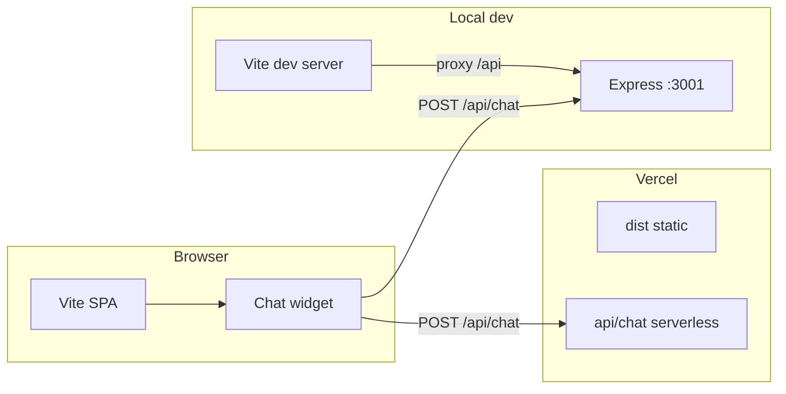

# Portfolio Website

## Abstract

This repository is a personal portfolio site with an embedded assistant that answers questions about the owner’s work using retrieval-augmented generation (RAG) over a local knowledge index, plus optional web search. The user interface is a React single-page application built with Vite and TypeScript. The chat API runs either as a local Express server or as a Vercel serverless function; both paths share the same request handler and RAG stack.

## Introduction and objectives

The site presents scroll-based sections (home, skills, experience and projects, contact) and a floating chat widget. The assistant is scoped to the portfolio: it is not intended as a general-purpose chat host. Answers are grounded in indexed documents and embeddings, with configurable retrieval depth for technical or detailed questions.

For implementation details split by layer, see [Frontend (`src/`)](./src/README.md) and [Backend (`server/`)](./server/README.md).

## System overview



| Part | Role | Documentation |
|------|------|----------------|
| [`src/`](./src/) | React UI, content data, chat client (same-origin `fetch` to `/api/chat`). | [Frontend README](./src/README.md) |
| [`server/`](./server/) | Express app, RAG, knowledge build scripts, shared runtime for Vercel. | [Backend README](./server/README.md) |
| [`api/chat.js`](./api/chat.js) | Vercel entry for `POST /api/chat` (streaming NDJSON). | [Backend README](./server/README.md) |
| [`public/`](./public/) | Static assets referenced by the UI (images, 3D model, favicon). | (see [Frontend README](./src/README.md)) |

## Quick start

```bash
npm install
npm run dev          # Vite only; chat needs the API (see below)
npm run server       # Express on :3001
npm run dev:full     # Vite + Express (recommended for full-stack local dev)
```

| Command | Purpose |
|---------|---------|
| `npm start` | **`rebuild-knowledge` + production build** (same as [`vercel.json`](./vercel.json) build). Use for local checks only if `OPENAI_API_KEY` / `GITHUB_TOKEN` are set; **not** for day-to-day dev. Some hosts default to `npm start` — this avoids accidentally running dev servers. For local dev, use **`npm run dev:full`**. |
| `npm run build` | Typecheck and production build to `dist/` (skips knowledge rebuild). |
| `npm run preview` | Serve the production build locally. |
| `npm run check` | `typecheck` then `lint`. |

## Configuration

Copy [`.env.example`](./.env.example) to `.env` at the repo root. **`OPENAI_API_KEY`** is required for chat and for building embeddings. **`TAVILY_API_KEY`** is optional and enables web search in the chat pipeline (set on the **runtime** environment for `/api/chat`, e.g. Vercel). Optional **`PORTFOLIO_OWNER_PREFIX`** unlocks owner/interview mode when the user message starts with that exact prefix; use a private value. **`PORT`**, **`CORS_ORIGIN`**, RAG tuning, GitHub indexing, and rate-limit variables are documented in `.env.example`; use that file as the checklist when deploying. Extra GitHub paths for RAG live in [`server/knowledge/github-extra-paths.json`](./server/knowledge/github-extra-paths.json).

## Deployment

### Vercel

1. Connect the repository. **Output directory:** `dist`. The **build command** is set in [`vercel.json`](./vercel.json): `npm run rebuild-knowledge && npm run build` so each deploy refreshes `documents.json` + GitHub-indexed chunks + `embeddings.json`, then builds the SPA. (If the Vercel dashboard overrides **Build Command**, either remove the override or set it to the same command.)
2. Set environment variables for **Production** (and **Preview** if you use preview deploys). For Path B, these must be available at **build** time: **`OPENAI_API_KEY`** (embeddings), **`GITHUB_TOKEN`** (repo fetch; use a classic PAT with `repo` for private repos). Optional: **`GITHUB_FULL_TREE=true`** for deeper indexing (see `.env.example` for limits). Runtime chat still needs **`OPENAI_API_KEY`** on the serverless function (same vars apply). Add **`TAVILY_API_KEY`** at runtime for live web search; optional **`PORTFOLIO_OWNER_PREFIX`** for owner/interview mode.
3. [`vercel.json`](./vercel.json) bundles `server/knowledge/**` into the `api/chat` function so the freshly built `embeddings.json` is included. You do **not** need to commit `embeddings.json` if every deploy runs `rebuild-knowledge`.
4. **Troubleshooting RAG / GitHub:** In Vercel **Build Logs**, search for `[build-knowledge]`. Confirm `GITHUB_TOKEN: set` (not missing or placeholder), `GITHUB_FULL_TREE: true` if you expect deep code indexing, and the summary line with counts from GitHub full-tree and partial fetch. For URL resolution without embeddings, run `npm run verify-github` locally.
5. Configure Upstash Redis (`UPSTASH_REDIS_REST_URL`, `UPSTASH_REDIS_REST_TOKEN`) and `RATE_LIMIT_MAX` for robust per-IP limits on the serverless route. If Redis is missing, the function uses a best-effort in-memory limiter per instance, which is weaker than centralized Redis limits.

Local development: `npm run dev` does not start the API. Use **`npm run dev:full`** so Vite proxies `/api` to Express on port 3001 ([`vite.config.ts`](./vite.config.ts)).

### Single Node process

Build the SPA, then run the Express app with `NODE_ENV=production`. The server can serve `dist/` from the same origin as `/api`.

```bash
npm run build
export NODE_ENV=production   # Unix / macOS / Git Bash
npm run server
```

On Windows **Command Prompt**, use `set NODE_ENV=production` before `npm run server`. On **PowerShell**, use `$env:NODE_ENV="production"`. Set **`OPENAI_API_KEY`**, **`CORS_ORIGIN`** (comma-separated allowed origins if the browser origin differs from the API), and **`PORT`** as required by the host.

## Deployment security checklist

- Keep all model/search tokens server-side only (`OPENAI_API_KEY`, `TAVILY_API_KEY`, `GITHUB_TOKEN`, Upstash keys). Do not expose them in client code or `VITE_*` variables.
- Configure centralized serverless rate limiting on Vercel (`UPSTASH_REDIS_REST_URL`, `UPSTASH_REDIS_REST_TOKEN`) plus `RATE_LIMIT_MAX`.
- If owner interview mode is used, set `PORTFOLIO_OWNER_PREFIX` to a private, hard-to-guess value.
- Verify `CORS_ORIGIN` is set correctly for production Express deployments.
- Run `npm run check` before deploy; monitor CI (`.github/workflows/ci.yml`) for type/lint and dependency audit results.
