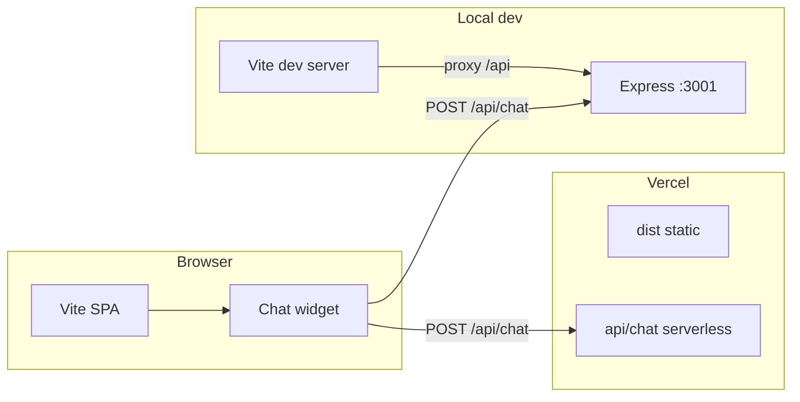

# Portfolio Website

## Abstract

This repository is a personal portfolio site with an embedded assistant that answers questions about the owner’s work using retrieval-augmented generation (RAG) over a local knowledge index, plus optional web search. The user interface is a React single-page application built with Vite and TypeScript. The chat API runs either as a local Express server or as a Vercel serverless function; both paths share the same request handler and RAG stack.

## Introduction and objectives

The site presents scroll-based sections (home, skills, experience and projects, contact) and a floating chat widget. The assistant is scoped to the portfolio: it is not intended as a general-purpose chat host. Answers are grounded in indexed documents and embeddings, with configurable retrieval depth for technical or detailed questions.

For implementation details split by layer, see [Frontend (`src/`)](./src/README.md) and [Backend (`server/`)](./server/README.md).

## System overview



| Part | Role | Documentation |
|------|------|----------------|
| [`src/`](./src/) | React UI, content data, chat client (same-origin `fetch` to `/api/chat`). | [Frontend README](./src/README.md) |
| [`server/`](./server/) | Express app, RAG, knowledge build scripts, shared runtime for Vercel. | [Backend README](./server/README.md) |
| [`api/chat.js`](./api/chat.js) | Vercel entry for `POST /api/chat` (streaming NDJSON). | [Backend README](./server/README.md) |
| [`public/`](./public/) | Static assets referenced by the UI (images, 3D model, favicon). | (see [Frontend README](./src/README.md)) |

## Quick start

```bash
npm install
npm run dev          # Vite only; chat needs the API (see below)
npm run server       # Express on :3001
npm run dev:full     # Vite + Express (recommended for full-stack local dev)
```

| Command | Purpose |
|---------|---------|
| `npm run build` | Typecheck and production build to `dist/`. |
| `npm run preview` | Serve the production build locally. |
| `npm run check` | `typecheck` then `lint`. |

## Configuration

Copy [`.env.example`](./.env.example) to `.env` at the repo root. **`OPENAI_API_KEY`** is required for chat and for building embeddings. **`TAVILY_API_KEY`** is optional and enables web search in the chat pipeline. **`PORT`**, **`CORS_ORIGIN`**, RAG tuning, GitHub indexing, and rate-limit variables are documented in `.env.example`; use that file as the checklist when deploying.

## Deployment

### Vercel

1. Connect the repository. Use build command `npm run build` and output directory `dist`.
2. Set environment variables in the project settings (at minimum `OPENAI_API_KEY`; optional keys are listed in `.env.example`).
3. RAG requires vector data in the deployment: commit [`server/knowledge/embeddings.json`](./server/knowledge/embeddings.json) or generate it in CI before deploy (`npm run rebuild-knowledge`). [`vercel.json`](./vercel.json) includes `server/knowledge/**` in the serverless function bundle.
4. Optional: configure Upstash Redis (`UPSTASH_REDIS_REST_URL`, `UPSTASH_REDIS_REST_TOKEN`) and `RATE_LIMIT_MAX` for per-IP limits on the serverless route. Without Redis, the function does not apply the same throttling as local Express.

Local development: `npm run dev` does not start the API. Use **`npm run dev:full`** so Vite proxies `/api` to Express on port 3001 ([`vite.config.ts`](./vite.config.ts)).

### Single Node process

Build the SPA, then run the Express app with `NODE_ENV=production`. The server can serve `dist/` from the same origin as `/api`.

```bash
npm run build
export NODE_ENV=production   # Unix / macOS / Git Bash
npm run server
```

On Windows **Command Prompt**, use `set NODE_ENV=production` before `npm run server`. On **PowerShell**, use `$env:NODE_ENV="production"`. Set **`OPENAI_API_KEY`**, **`CORS_ORIGIN`** (comma-separated allowed origins if the browser origin differs from the API), and **`PORT`** as required by the host.
